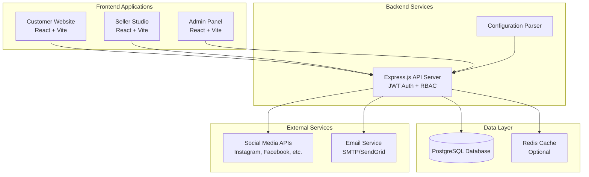
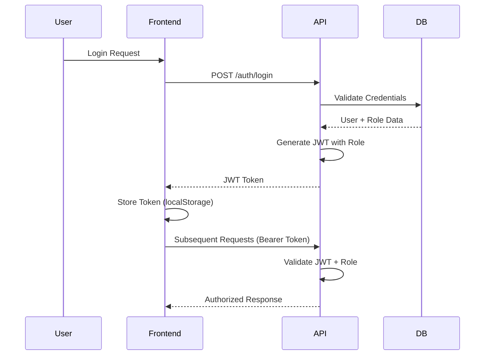

# Design Document

## Overview

The ecommerce platform consists of three distinct React applications sharing a common Node.js/Express backend API and PostgreSQL database. The architecture follows a multi-app frontend pattern with centralized data management, implementing role-based access control to ensure users only access appropriate features for their roles.

**Key Design Principles:**
- **Separation of Concerns**: Each frontend application serves a specific user role with tailored interfaces
- **Shared Backend**: Single API server handles all business logic and data operations
- **Role-Based Security**: JWT tokens with embedded roles control access across all applications
- **Data Consistency**: PostgreSQL as single source of truth with proper relational design
- **Performance**: Optimized queries, pagination, and lazy loading for responsive user experience

## Architecture

### High-Level Architecture



### Application Routing Strategy

Each frontend application runs on different ports/domains with distinct routing:

- **Customer Website** (`/`): Public routes + authenticated customer routes
- **Seller Studio** (`/seller`): Protected seller-only routes
- **Admin Panel** (`/admin`): Protected admin-only routes

### Authentication Flow



## Components and Interfaces

### Frontend Applications

#### Customer Website Components
- **HomePage**: Featured products, categories, search bar
- **ProductCatalog**: Product listing with filters and pagination
- **ProductDetail**: Product information, reviews, add to cart/wishlist
- **ShoppingCart**: Cart management and checkout initiation
- **Checkout**: Payment and shipping information collection
- **UserProfile**: Account management, order history, wishlist
- **OrderHistory**: Past orders with status tracking
- **AISearch**: Natural language search interface

#### Seller Studio Components
- **Dashboard**: Sales KPIs, recent orders, performance metrics
- **ProductManager**: CRUD operations for seller's products
- **InventoryManager**: Stock levels, low-stock alerts
- **OrderManager**: Order fulfillment and status updates
- **PromotionManager**: Discount creation and scheduling
- **MarketingCampaigns**: Multi-channel campaign creation and management
- **EmailTemplates**: Template creation and automation setup
- **Analytics**: Sales trends, customer insights, campaign ROI

#### Admin Panel Components
- **PlatformDashboard**: System-wide metrics and health monitoring
- **UserManager**: Customer and seller account management
- **ContentModerator**: Product and review approval/rejection
- **CampaignMonitor**: Oversight of all seller marketing activities
- **ConfigurationManager**: Platform settings, fees, commission rates
- **AuditLogs**: Administrative action tracking
- **SystemHealth**: Database performance, API metrics, error monitoring

### Backend API Structure

#### Core Modules
- **Authentication Service**: JWT generation, validation, password hashing
- **Authorization Middleware**: Role-based route protection
- **User Service**: User management across all roles
- **Product Service**: Product CRUD, search, categorization
- **Order Service**: Order processing, inventory updates
- **Review Service**: Review management and moderation
- **Marketing Service**: Campaign management and social media integration
- **Analytics Service**: Data aggregation and reporting
- **Configuration Service**: Application settings and parsing

#### API Endpoints Structure

```
/api/v1/
├── auth/
│   ├── POST /login
│   ├── POST /register
│   ├── POST /refresh
│   └── POST /logout
├── users/
│   ├── GET /profile
│   ├── PUT /profile
│   └── GET /orders (customer)
├── products/
│   ├── GET / (with filters, pagination)
│   ├── GET /:id
│   ├── POST / (seller only)
│   ├── PUT /:id (seller only)
│   └── DELETE /:id (seller only)
├── orders/
│   ├── POST / (customer)
│   ├── GET / (role-based filtering)
│   └── PUT /:id/status (seller/admin)
├── reviews/
│   ├── GET /product/:id
│   ├── POST / (customer)
│   └── PUT /:id/moderate (admin)
├── marketing/
│   ├── POST /campaigns (seller)
│   ├── GET /campaigns (seller/admin)
│   └── GET /analytics (seller/admin)
└── admin/
    ├── GET /users
    ├── GET /platform-stats
    └── PUT /settings
```

## Data Models

### Core Database Schema

```sql
-- Users table with role-based access
CREATE TABLE users (
    id SERIAL PRIMARY KEY,
    email VARCHAR(255) UNIQUE NOT NULL,
    password_hash VARCHAR(255) NOT NULL,
    role VARCHAR(20) NOT NULL CHECK (role IN ('CUSTOMER', 'SELLER', 'ADMIN')),
    first_name VARCHAR(100),
    last_name VARCHAR(100),
    phone VARCHAR(20),
    is_active BOOLEAN DEFAULT true,
    created_at TIMESTAMP DEFAULT CURRENT_TIMESTAMP,
    updated_at TIMESTAMP DEFAULT CURRENT_TIMESTAMP
);

-- Seller profiles for extended seller information
CREATE TABLE sellers (
    id SERIAL PRIMARY KEY,
    user_id INTEGER REFERENCES users(id) ON DELETE CASCADE,
    business_name VARCHAR(255) NOT NULL,
    business_description TEXT,
    business_address TEXT,
    commission_rate DECIMAL(5,2) DEFAULT 5.00,
    is_verified BOOLEAN DEFAULT false,
    created_at TIMESTAMP DEFAULT CURRENT_TIMESTAMP
);

-- Product catalog
CREATE TABLE products (
    id SERIAL PRIMARY KEY,
    seller_id INTEGER REFERENCES sellers(id) ON DELETE CASCADE,
    name VARCHAR(255) NOT NULL,
    description TEXT,
    price DECIMAL(10,2) NOT NULL,
    stock_quantity INTEGER NOT NULL DEFAULT 0,
    category VARCHAR(100),
    sku VARCHAR(100) UNIQUE,
    images JSONB, -- Array of image URLs
    is_active BOOLEAN DEFAULT true,
    created_at TIMESTAMP DEFAULT CURRENT_TIMESTAMP,
    updated_at TIMESTAMP DEFAULT CURRENT_TIMESTAMP
);

-- Order management
CREATE TABLE orders (
    id SERIAL PRIMARY KEY,
    customer_id INTEGER REFERENCES users(id),
    total_amount DECIMAL(10,2) NOT NULL,
    status VARCHAR(50) DEFAULT 'pending',
    shipping_address JSONB NOT NULL,
    payment_status VARCHAR(50) DEFAULT 'pending',
    created_at TIMESTAMP DEFAULT CURRENT_TIMESTAMP,
    updated_at TIMESTAMP DEFAULT CURRENT_TIMESTAMP
);

CREATE TABLE order_items (
    id SERIAL PRIMARY KEY,
    order_id INTEGER REFERENCES orders(id) ON DELETE CASCADE,
    product_id INTEGER REFERENCES products(id),
    quantity INTEGER NOT NULL,
    unit_price DECIMAL(10,2) NOT NULL,
    total_price DECIMAL(10,2) NOT NULL
);

-- Review system
CREATE TABLE reviews (
    id SERIAL PRIMARY KEY,
    product_id INTEGER REFERENCES products(id) ON DELETE CASCADE,
    customer_id INTEGER REFERENCES users(id),
    rating INTEGER CHECK (rating >= 1 AND rating <= 5),
    comment TEXT,
    is_approved BOOLEAN DEFAULT false,
    created_at TIMESTAMP DEFAULT CURRENT_TIMESTAMP,
    UNIQUE(product_id, customer_id)
);

-- Wishlist functionality
CREATE TABLE wishlists (
    id SERIAL PRIMARY KEY,
    customer_id INTEGER REFERENCES users(id) ON DELETE CASCADE,
    product_id INTEGER REFERENCES products(id) ON DELETE CASCADE,
    created_at TIMESTAMP DEFAULT CURRENT_TIMESTAMP,
    UNIQUE(customer_id, product_id)
);

-- Marketing campaigns
CREATE TABLE campaigns (
    id SERIAL PRIMARY KEY,
    seller_id INTEGER REFERENCES sellers(id) ON DELETE CASCADE,
    name VARCHAR(255) NOT NULL,
    description TEXT,
    budget DECIMAL(10,2),
    start_date TIMESTAMP,
    end_date TIMESTAMP,
    status VARCHAR(50) DEFAULT 'draft',
    created_at TIMESTAMP DEFAULT CURRENT_TIMESTAMP
);

CREATE TABLE campaign_channels (
    id SERIAL PRIMARY KEY,
    campaign_id INTEGER REFERENCES campaigns(id) ON DELETE CASCADE,
    channel VARCHAR(50) NOT NULL, -- 'instagram', 'facebook', 'email', etc.
    channel_config JSONB, -- Channel-specific configuration
    is_active BOOLEAN DEFAULT true
);

CREATE TABLE email_templates (
    id SERIAL PRIMARY KEY,
    seller_id INTEGER REFERENCES sellers(id) ON DELETE CASCADE,
    name VARCHAR(255) NOT NULL,
    subject VARCHAR(255),
    html_content TEXT,
    trigger_type VARCHAR(50), -- 'welcome', 'abandoned_cart', 'order_confirmation'
    is_active BOOLEAN DEFAULT true,
    created_at TIMESTAMP DEFAULT CURRENT_TIMESTAMP
);

-- Campaign performance tracking
CREATE TABLE campaign_metrics (
    id SERIAL PRIMARY KEY,
    campaign_id INTEGER REFERENCES campaigns(id) ON DELETE CASCADE,
    channel VARCHAR(50),
    metric_type VARCHAR(50), -- 'impressions', 'clicks', 'conversions'
    metric_value INTEGER,
    recorded_at TIMESTAMP DEFAULT CURRENT_TIMESTAMP
);

-- Promotions and discounts
CREATE TABLE promotions (
    id SERIAL PRIMARY KEY,
    seller_id INTEGER REFERENCES sellers(id) ON DELETE CASCADE,
    name VARCHAR(255) NOT NULL,
    discount_type VARCHAR(20) CHECK (discount_type IN ('percentage', 'fixed')),
    discount_value DECIMAL(10,2) NOT NULL,
    min_order_amount DECIMAL(10,2),
    start_date TIMESTAMP,
    end_date TIMESTAMP,
    is_active BOOLEAN DEFAULT true,
    created_at TIMESTAMP DEFAULT CURRENT_TIMESTAMP
);

-- Platform configuration
CREATE TABLE platform_settings (
    id SERIAL PRIMARY KEY,
    setting_key VARCHAR(100) UNIQUE NOT NULL,
    setting_value JSONB,
    description TEXT,
    updated_at TIMESTAMP DEFAULT CURRENT_TIMESTAMP
);

-- Payment tracking
CREATE TABLE payments (
    id SERIAL PRIMARY KEY,
    order_id INTEGER REFERENCES orders(id),
    amount DECIMAL(10,2) NOT NULL,
    payment_method VARCHAR(50),
    transaction_id VARCHAR(255),
    status VARCHAR(50) DEFAULT 'pending',
    processed_at TIMESTAMP,
    created_at TIMESTAMP DEFAULT CURRENT_TIMESTAMP
);
```

### Data Relationships

- **Users** have roles (CUSTOMER, SELLER, ADMIN) determining application access
- **Sellers** extend user accounts with business information
- **Products** belong to sellers and can have multiple reviews
- **Orders** contain multiple order_items linking to products
- **Campaigns** belong to sellers and can have multiple channels
- **Reviews** link customers to products with uniqueness constraints
- **Wishlists** create many-to-many relationships between customers and products

### Indexing Strategy

```sql
-- Performance indexes
CREATE INDEX idx_users_email ON users(email);
CREATE INDEX idx_users_role ON users(role);
CREATE INDEX idx_products_seller ON products(seller_id);
CREATE INDEX idx_products_category ON products(category);
CREATE INDEX idx_products_active ON products(is_active);
CREATE INDEX idx_orders_customer ON orders(customer_id);
CREATE INDEX idx_orders_status ON orders(status);
CREATE INDEX idx_reviews_product ON reviews(product_id);
CREATE INDEX idx_reviews_approved ON reviews(is_approved);
CREATE INDEX idx_campaigns_seller ON campaigns(seller_id);
CREATE INDEX idx_campaign_metrics_campaign ON campaign_metrics(campaign_id);
```

Now I need to use the prework tool to analyze the acceptance criteria before writing the Correctness Properties section.

<function_calls>
<invoke name="prework">
<parameter name="featureName">ecommerce-platform

## Correctness Properties

*A property is a characteristic or behavior that should hold true across all valid executions of a system—essentially, a formal statement about what the system should do. Properties serve as the bridge between human-readable specifications and machine-verifiable correctness guarantees.*

Based on the prework analysis, the following properties have been identified to validate the system's correctness across all requirements:

### Authentication and Authorization Properties

**Property 1: User Registration with Role Assignment**
*For any* valid user registration data, creating a user account should result in a user record with exactly one of the three valid roles (CUSTOMER, SELLER, ADMIN) and properly hashed password
**Validates: Requirements 1.1, 1.7**

**Property 2: JWT Authentication Flow**
*For any* valid user credentials, the authentication process should return a JWT token containing the user's role information and the token should be valid for subsequent requests
**Validates: Requirements 1.2, 1.3**

**Property 3: Role-Based Access Control**
*For any* user with a specific role, access to application features should be restricted according to their role: CUSTOMER users can only access Customer_Website, SELLER users can only access Seller_Studio, and ADMIN users can access all applications
**Validates: Requirements 1.4, 1.5, 1.6**

**Property 4: Token Expiration Enforcement**
*For any* expired JWT token, all protected route requests should be rejected and require re-authentication
**Validates: Requirements 1.8**

### Product and Order Management Properties

**Property 5: Product Catalog Display**
*For any* product catalog request, the response should include products with filtering capabilities, category organization, and proper pagination
**Validates: Requirements 2.2, 2.3**

**Property 6: Cart State Persistence**
*For any* cart operation (add, remove, update), the cart state should be persisted and totals should be recalculated correctly
**Validates: Requirements 2.4**

**Property 7: Order Processing Integrity**
*For any* order placement, the system should verify product availability, create proper order records with relationships, and update inventory levels atomically
**Validates: Requirements 2.7, 9.2, 9.4, 9.6**

**Property 8: Seller Data Isolation**
*For any* seller account, all product and order management operations should only return or modify data belonging to that specific seller
**Validates: Requirements 4.7**

### Search and AI Properties

**Property 9: Natural Language Search Processing**
*For any* natural language search query, the system should parse intent and constraints, convert to structured database queries, and return relevant results sorted appropriately
**Validates: Requirements 3.1, 3.2, 3.3**

**Property 10: Search Analytics Logging**
*For any* search operation, the system should log the query and results for analytics purposes
**Validates: Requirements 3.5**

### Marketing Campaign Properties

**Property 11: Campaign Management**
*For any* valid campaign data, sellers should be able to create campaigns with multiple channels, schedule execution, and track performance metrics
**Validates: Requirements 5.1, 5.2, 5.4**

**Property 12: Email Template Management**
*For any* email template, sellers should be able to create, customize, and preview templates with automation triggers
**Validates: Requirements 5.3, 5.6**

### Review System Properties

**Property 13: Review Validation and Storage**
*For any* review submission, the system should validate that the customer purchased the product, prevent duplicate reviews, and store the review with proper associations
**Validates: Requirements 10.2, 10.3, 10.6**

**Property 14: Rating Calculation**
*For any* product with reviews, the average rating should be calculated from all approved reviews and displayed with helpful metrics
**Validates: Requirements 10.1, 10.4, 10.7**

### Database and Security Properties

**Property 15: Database Referential Integrity**
*For any* data insertion or update operation, the database should enforce foreign key constraints and maintain referential integrity
**Validates: Requirements 7.6**

**Property 16: Input Validation and Security**
*For any* user input, the system should validate and sanitize data to prevent injection attacks, implement rate limiting, and log security events
**Validates: Requirements 8.1, 8.2, 8.8**

**Property 17: Performance Optimization**
*For any* large dataset request, the system should implement pagination, lazy loading, and use optimized queries with appropriate indexes
**Validates: Requirements 8.3, 8.4, 8.5**

### Configuration and Serialization Properties

**Property 18: Configuration Round-Trip**
*For any* valid configuration object, parsing then printing then parsing should produce an equivalent object
**Validates: Requirements 11.4**

**Property 19: API Serialization Round-Trip**
*For any* valid API object, serializing then deserializing should produce an equivalent object
**Validates: Requirements 11.7**

**Property 20: Configuration Error Handling**
*For any* invalid configuration file, the parser should return descriptive error messages without crashing
**Validates: Requirements 11.2**

## Error Handling

### Error Categories and Responses

**Authentication Errors:**
- Invalid credentials: Return 401 with clear error message
- Expired tokens: Return 401 and require re-authentication
- Insufficient permissions: Return 403 with role-specific guidance

**Validation Errors:**
- Invalid input data: Return 400 with field-specific error details
- Missing required fields: Return 400 with list of missing fields
- Business rule violations: Return 422 with explanation

**Resource Errors:**
- Not found: Return 404 with resource type and identifier
- Conflict: Return 409 for duplicate resources or constraint violations
- Gone: Return 410 for soft-deleted resources

**System Errors:**
- Database connection issues: Return 503 with retry guidance
- External service failures: Return 502 with fallback options
- Rate limiting: Return 429 with retry-after header

### Error Response Format

```json
{
  "error": {
    "code": "VALIDATION_ERROR",
    "message": "Invalid input data provided",
    "details": [
      {
        "field": "email",
        "message": "Email format is invalid"
      }
    ],
    "timestamp": "2024-01-15T10:30:00Z",
    "requestId": "req_123456"
  }
}
```

### Graceful Degradation

- **Search Service Down**: Fall back to basic database search
- **Social Media API Failures**: Queue campaigns for retry
- **Email Service Issues**: Store emails for later delivery
- **Image Service Problems**: Show placeholder images
- **Cache Failures**: Serve from database with performance warning

## Testing Strategy

### Dual Testing Approach

The testing strategy combines **unit tests** for specific examples and edge cases with **property-based tests** for universal correctness validation. Both approaches are complementary and necessary for comprehensive coverage.

**Unit Testing Focus:**
- Specific examples demonstrating correct behavior
- Edge cases and boundary conditions
- Error handling scenarios
- Integration points between components
- Authentication and authorization flows

**Property-Based Testing Focus:**
- Universal properties that hold for all valid inputs
- Comprehensive input coverage through randomization
- Data integrity and consistency validation
- Business rule enforcement across all scenarios

### Property-Based Testing Configuration

**Framework Selection:**
- **Node.js Backend**: Use `fast-check` library for property-based testing
- **React Frontend**: Use `@fast-check/jest` for component property testing

**Test Configuration:**
- Minimum **100 iterations** per property test due to randomization
- Each property test must reference its design document property
- Tag format: **Feature: ecommerce-platform, Property {number}: {property_text}**

**Property Test Implementation:**
- Each correctness property must be implemented by a single property-based test
- Tests should generate random valid inputs within domain constraints
- Properties should validate universal behaviors, not specific examples
- Failed tests should provide clear counterexamples for debugging

### Test Categories

**Authentication Tests:**
- Unit: Specific login/logout scenarios, token validation edge cases
- Property: Authentication flow works for any valid credentials

**Product Management Tests:**
- Unit: Specific product CRUD operations, validation edge cases
- Property: Product operations maintain data integrity for any valid input

**Order Processing Tests:**
- Unit: Specific checkout flows, payment processing scenarios
- Property: Order processing maintains inventory consistency for any order

**Search Functionality Tests:**
- Unit: Specific search queries, empty result handling
- Property: Search processing works correctly for any natural language input

**Campaign Management Tests:**
- Unit: Specific campaign creation, template management scenarios
- Property: Campaign operations work correctly for any valid campaign data

### Integration Testing

**API Integration:**
- Test complete request/response cycles
- Validate role-based access control across all endpoints
- Test error handling and recovery scenarios

**Database Integration:**
- Test transaction handling and rollback scenarios
- Validate foreign key constraints and data integrity
- Test concurrent access and race condition handling

**External Service Integration:**
- Mock social media APIs for campaign testing
- Test email service integration with fallback handling
- Validate payment processing integration